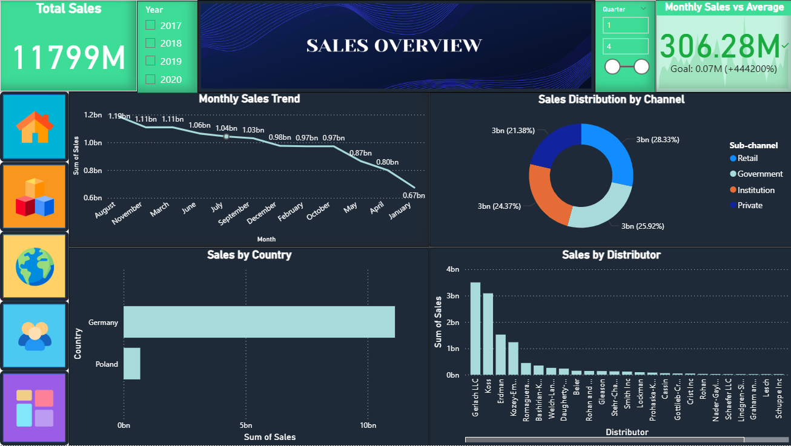
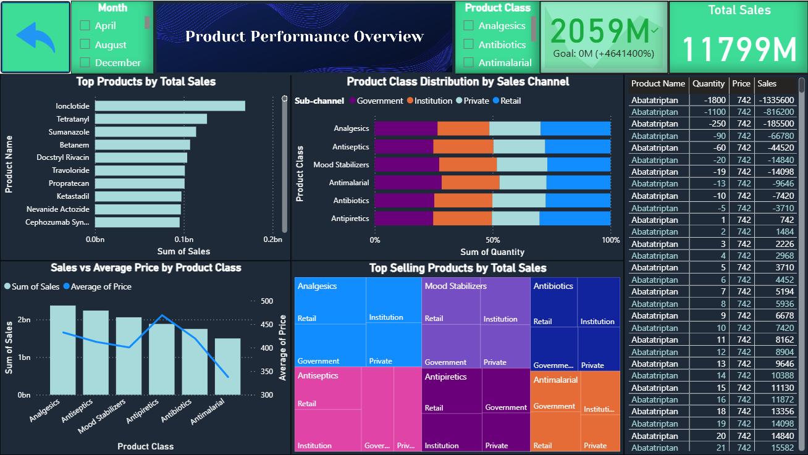
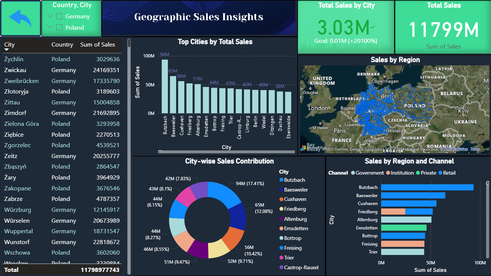
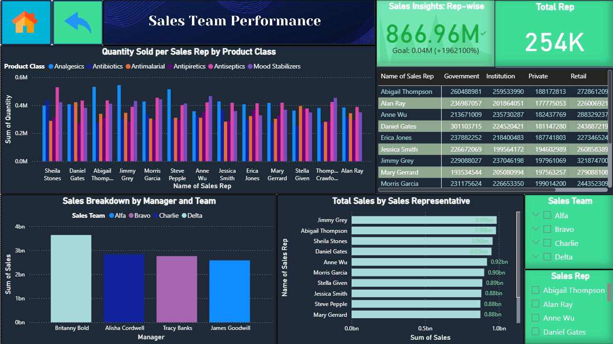

# 💊 Pharmaceutical Sales Intelligence Dashboard

This project is a complete end-to-end Business Intelligence solution built using **Excel**, **Python (Pandas)**, and **Power BI**. It analyzes raw pharmaceutical sales data to uncover actionable insights across products, geographies, sales reps, customer channels, and performance trends.

---

## 🎯 Objective

To build an interactive, multi-page Power BI dashboard that supports data-driven decision-making by visualizing sales performance across various business dimensions — including product trends, team output, and regional performance.

---

## 📊 Dashboard Overview

### 🔹 Sales Overview
Key metrics like total sales, average price, and top rep performance — with time-based trends and filters.

---

### 🔹 Product Performance
Analysis of product categories and sub-channels with tree maps, sales vs. price comparison, and filtering.

---

### 🔹 Geographic Sales
Map visuals highlighting city and country-level performance using latitude and longitude data.

---

### 🔹 Sales Team Performance
Sales rep and manager insights with charts ranking individuals and summarizing channel-wise contribution.

---

## 👨‍💻 Author  
**Ashad K**  
📍 *India* | 💼 *Open to opportunities in UAE*  
📧 **ashadakber32@gmail.com**  
🔗 [LinkedIn](https://www.linkedin.com/in/ashad-k)  
🔗 [GitHub](https://github.com/Ashad777)

---

## 🤝 Let’s Connect

If you're a recruiter, hiring manager, or fellow data professional, feel free to reach out. I'm actively seeking full-time roles in:

- 📊 Data Analysis  
- 📈 Business Intelligence  
- 🧠 ML / AI Roles  

Especially within the **UAE job market**.

⭐ If you found this project helpful, feel free to **star the repo** or **connect with me**!
